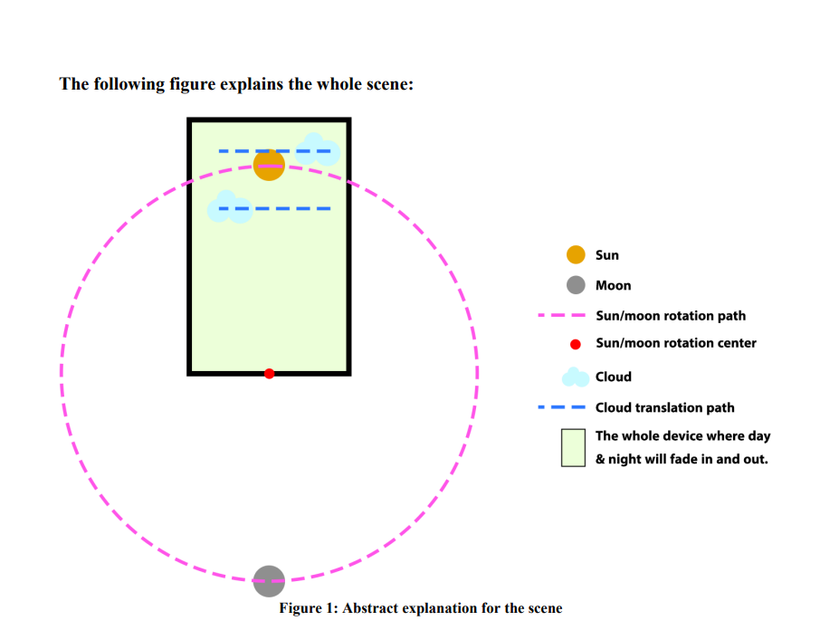
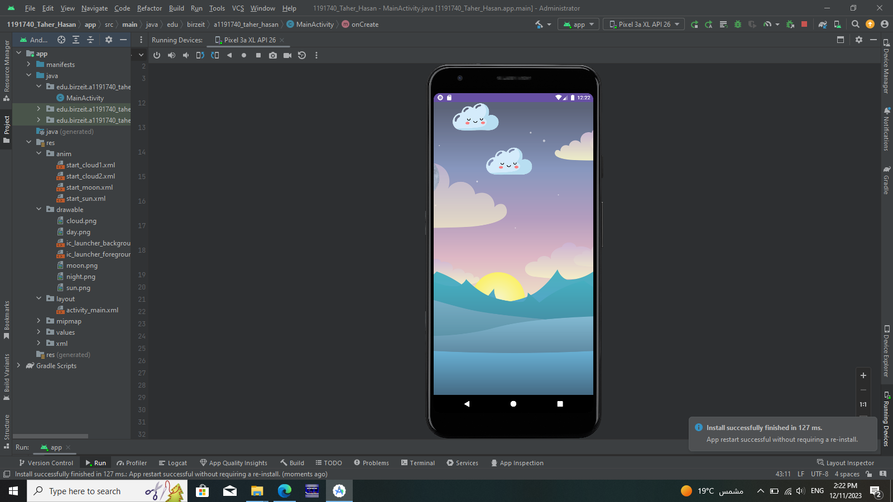
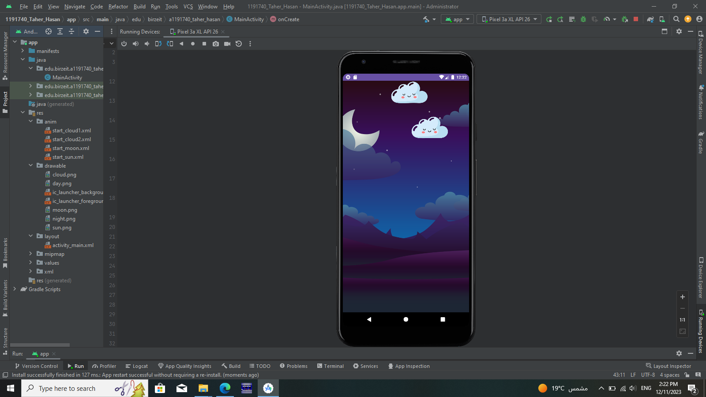

# Day-Night Cycle Animation Project

## Overview
This project involves creating an Android application that demonstrates a day-night cycle animation using Android Studio. The animation includes the rotation of the sun and moon, as well as cloud movement. The project emphasizes smooth transitions between day and night, with gradual fades and realistic object movements.

## Objective
Develop an Android application with the following features:
- Gradual transition between day and night.
- Sun and moon rotation with a common center.
- Cloud movement with proper positioning.
- Appropriate fade-in and fade-out effects for background transitions.

## Assets Required
1. Day background image.
2. Night background image.
3. Sun image (PNG format with a transparent background).
4. Moon image (PNG format with a transparent background).
5. Cloud image (PNG format with a transparent background).

## Animation Logic
1. **Sun Animation:**
   - The sun rotates in and out of the screen.
   - Rotation center for sun and moon: Middle of the screen on the X-axis, bottom of the screen on the Y-axis.

2. **Day-Night Transition:**
   - Simulation starts in the middle of the day (sun in the middle of the x-axis).
   - Day background remains visible while the sun is moving (clockwise).
   - Gradually fade in the night background after the sun is out of the screen.
   - Rotate the moon on the same path as the sun (clockwise).
   - Moon enters from the left and exits from the right.
   - Fade out the night background as the moon exits to show the day background.
   - Transition back to the day background with the sun's appearance.

3. **Cloud Movement:**
   - Two cloud images moving in translation across the screen (on the x-axis).
   - One cloud above the sun, one behind it.
   - Clouds move for specified durations (8 seconds and 12 seconds).

## Scene Representation
Refer to Figure 1 for an abstract explanation of the scene. Use clipart, emojis, or real-life images; avoid abstracted objects.

**Figure 1: Abstract explanation for the scene**

## Project Guidelines
- Utilize PNG images for sun, moon, and clouds to avoid white backgrounds.
- Avoid abstracted objects (circles/squares); use clipart/emojis/real-life images.
- Whole day and night cycle should be 20 seconds (10 for day, 10 for night).
- Transitions should not be instantaneous; use fade-in and fade-out effects.
- Sun and moon move on the same path and direction (clockwise).
- Object sizes should be relatively close to those in Figure 1.
- Day/night backgrounds should fill the whole screen.
- Application name: "1191740_TaherHasan".
- Use Pixel 3a XL device with API Level 26 (Graphic=Software).

## Results
**Day Background**

**Night Background**

